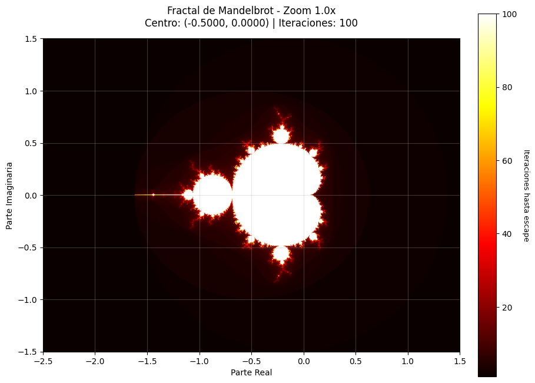
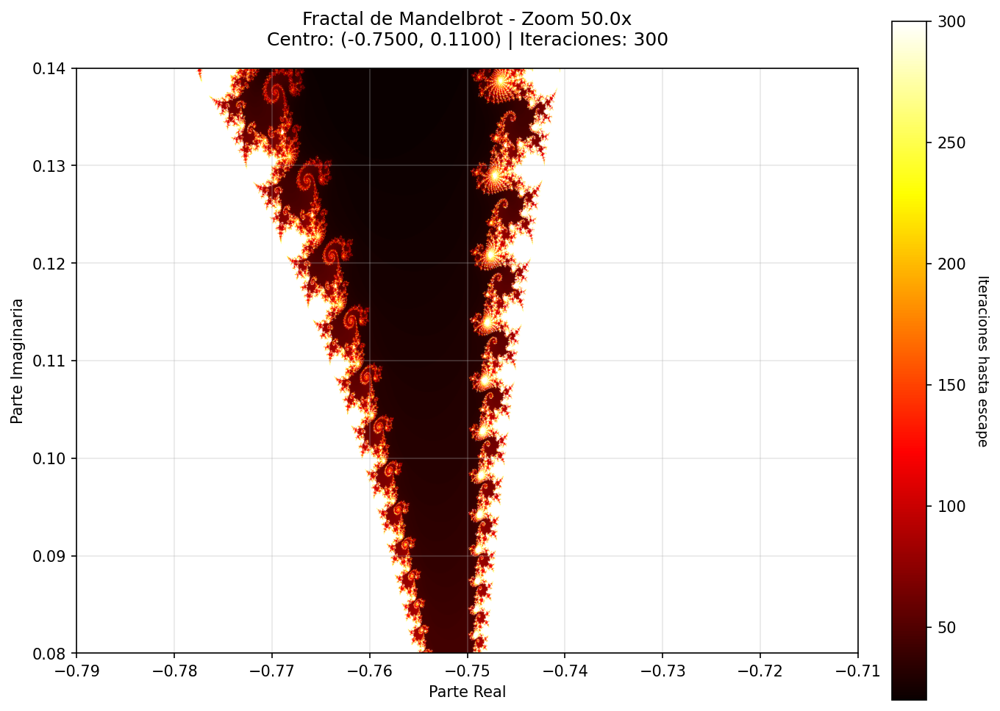
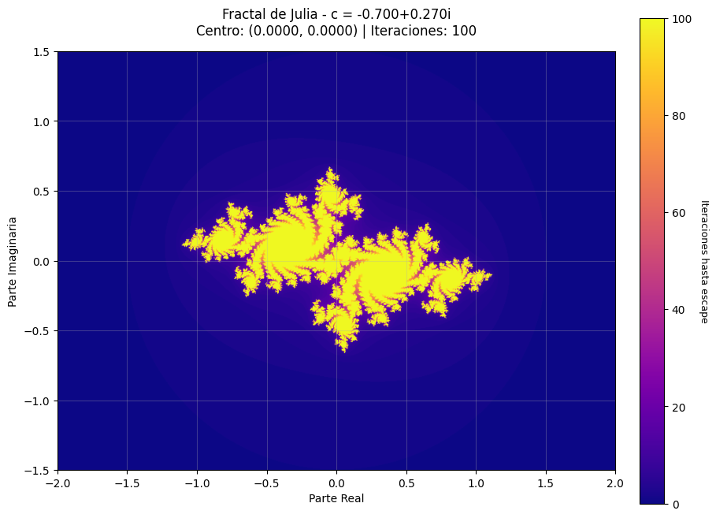
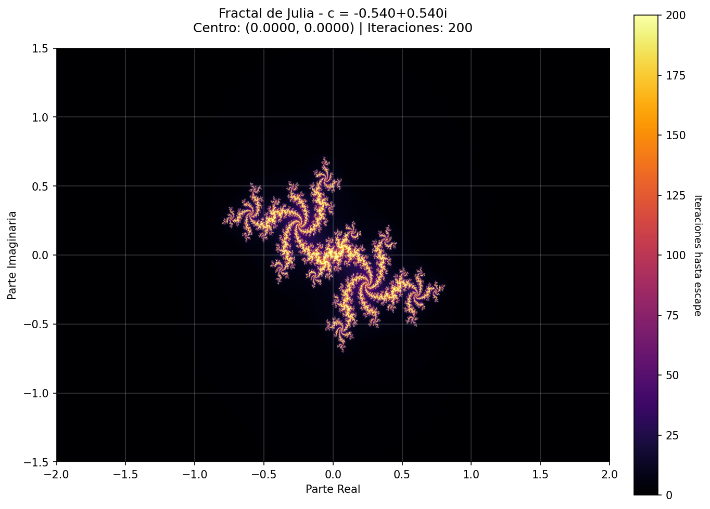
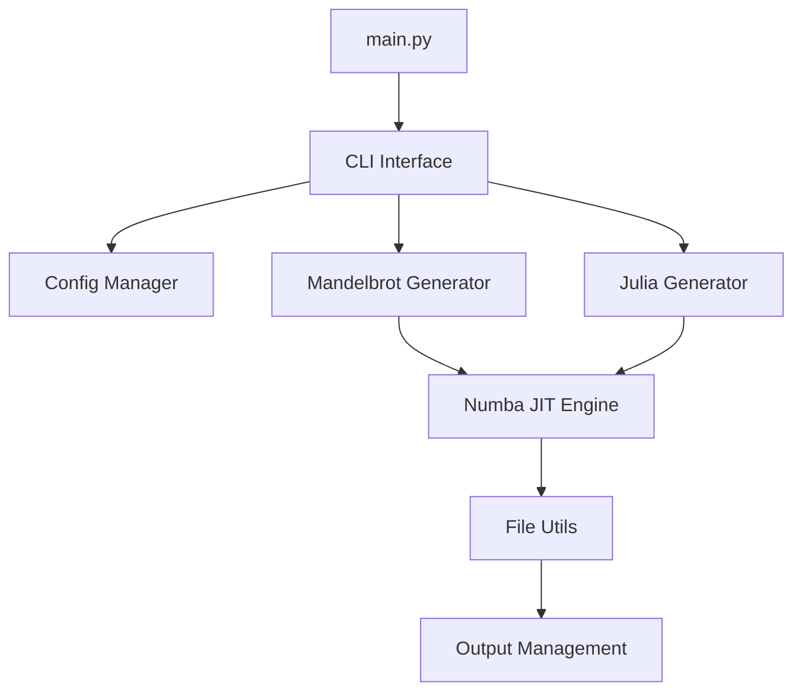

# 🎨 Fractal Gallery - Generador de Arte Matemático

<div align="center">

[](https://python.org)
[](https://opensource.org/licenses/MIT)
[](https://github.com/dvchinx/fractal-gallery)
[](https://numba.pydata.org/)

*Un generador de arte fractal ultra-optimizado que crea imágenes matemáticamente hermosas usando algoritmos eficientes y compilación JIT con Numba.*

</div>

## 📋 Tabla de Contenidos

- [📸 Galería de Ejemplos](#-galería-de-ejemplos)
- [✨ Características Principales](#-características-principales)
- [🚀 Instalación Rápida](#-instalación-rápida)
- [⚡ Inicio Rápido](#-inicio-rápido)
- [📚 Documentación](#-documentación)
- [⚡ Rendimiento](#-rendimiento)
- [🗺️ Roadmap](#️-roadmap)
- [🤝 Contribuir](#-contribuir)

## 📸 Galería de Ejemplos

<div align="center">

### Fractales de Mandelbrot



### Fractales de Julia



*Ejemplos de fractales generados con diferentes parámetros y esquemas de colores*

</div>

## ✨ Características Principales

<table>
<tr>
<td>

### 🌀 **Fractales de Mandelbrot**
- Zoom profundo hasta 10^12
- Exploración de puntos interesantes
- Navegación inteligente por regiones

</td>
<td>

### 🎭 **Fractales de Julia**
- 10+ presets famosos incluidos
- Constantes personalizadas
- Galería automática de variaciones

</td>
</tr>
<tr>
<td>

### ⚡ **Ultra-optimizado**
- Numba JIT compilation
- Paralelización automática
- Velocidad de código nativo

</td>
<td>

### 🎨 **Esquemas de colores**
- 16+ colormaps categorizados
- Paletas científicas y artísticas
- Personalización completa

</td>
</tr>
<tr>
<td>

### 📁 **Gestión inteligente**
- Auto-guardado con metadatos
- Generación de miniaturas
- Organización automática

</td>
<td>

### 🌐 **Galería HTML**
- Visualización web interactiva
- Navegación por categorías
- Responsive design

</td>
</tr>
</table>

## 🚀 Instalación Rápida

### ⚙️ Requisitos del Sistema
```bash
Python 3.8+    # Versión mínima requerida
4GB RAM        # Recomendado para imágenes HD
```

### 📦 Instalación en 3 pasos

1. **Clonar el repositorio**
   ```bash
   git clone https://github.com/dvchinx/fractal-gallery.git
   cd fractal-gallery
   ```

2. **Instalar dependencias**
   ```bash
   pip install -r requirements.txt
   ```

3. **Verificar instalación**
   ```bash
   python main.py info
   ```

## ⚡ Inicio Rápido

```bash
# 🌀 Tu primer fractal de Mandelbrot
python main.py mandelbrot

# 🎭 Julia clásico con alta calidad
python main.py julia --julia-c classic --preset high

# 🖼️ Generar galería HTML completa
python main.py gallery
```

## 📚 Documentación

### 📖 Guías Completas

- **[📚 Guía de Uso Completa](docs/USAGE_GUIDE.md)** - Comandos, ejemplos y configuración avanzada
- **[🔍 Visualización Interactiva](docs/HOW_TO_USE.md)** - Herramientas de exploración visual
- **[⚙️ Configuración](config/fractal_config.yaml)** - Parámetros y personalización

### 🎯 Enlaces Rápidos

| Necesitas | Documento |
|-----------|-----------|
| 🚀 Empezar ahora | [Instalación](#-instalación-rápida) |
| 📝 Todos los comandos | [Guía de Uso](docs/USAGE_GUIDE.md) |
| 🎨 Ejemplos artísticos | [Guía de Uso](docs/USAGE_GUIDE.md#-ejemplos-prácticos) |
| ⚙️ Configurar parámetros | [Guía de Uso](docs/USAGE_GUIDE.md#-presets-y-parámetros) |
| 🎨 Esquemas de colores | [Guía de Uso](docs/USAGE_GUIDE.md#-esquemas-de-colores) |
| 🔧 Personalización | [Guía de Uso](docs/USAGE_GUIDE.md#-personalización) |

## ⚡ Rendimiento

### 🚀 Optimizaciones Técnicas

<table>
<tr>
<td>

**🔥 Numba JIT Compilation**
- Primera ejecución: ~30-60s (compilación)
- Ejecuciones siguientes: Ultra-rápidas
- Código optimizado a nivel nativo
- Paralelización automática

</td>
<td>

**📊 Benchmarks**
- CPU i7-10700K @ 3.8GHz
- Preview (400×300): ~0.5s
- HD (1920×1080): ~8s  
- 4K (3840×2160): ~45s
- Escalabilidad lineal con cores

</td>
</tr>
</table>

### 📈 Comparación de Rendimiento

| Resolución | Sin Numba | Con Numba | Aceleración |
|------------|-----------|-----------|-------------|
| 400×300 | 15s | 0.5s | **30x** |
| 1920×1080 | 180s | 8s | **22x** |
| 3840×2160 | 720s | 45s | **16x** |

## 📂 Estructura del Proyecto

```
fractal-gallery/
├── main.py                    # Script principal
├── requirements.txt           # Dependencias Python
├── README.md                 # Esta documentación
├── src/                      # Código fuente
│   ├── mandelbrot.py         # Generador de Mandelbrot optimizado
│   ├── julia.py              # Generador de Julia con presets
│   ├── config_manager.py     # Sistema de configuración
│   └── file_utils.py         # Gestión de archivos y metadatos
├── config/                   # Archivos de configuración
│   └── fractal_config.yaml   # Configuración principal
├── output/                   # Imágenes generadas
│   ├── mandelbrot/           # Fractales de Mandelbrot
│   ├── julia/                # Fractales de Julia
│   ├── thumbnails/           # Miniaturas automáticas
│   ├── metadata/             # Metadatos YAML
│   └── gallery/              # Galerías HTML
├── screenshots/              # Capturas para documentación
└── docs/                     # Documentación adicional
```

## 🔬 Detalles Técnicos

### 🧮 Algoritmos Implementados

- **Mandelbrot Set**: Implementación optimizada con escape radius
- **Julia Sets**: Familia completa con constantes complejas
- **Colorización**: Mapeo logarítmico y linear de iteraciones
- **Anti-aliasing**: Supersampling opcional para calidad profesional

### 🏗️ Arquitectura del Software



## 🗺️ Roadmap y Próximas Características

### 🚀 Versión 2.0 (En desarrollo)

- [ ] **🔥 Burning Ship fractals**: Variación del Mandelbrot con matemáticas complejas
- [ ] **🧮 Newton fractals**: Fractales basados en el método de Newton-Raphson
- [ ] **🎬 Animaciones**: Secuencias de zoom y transformación en GIF/MP4
- [ ] **🎨 Arte procedural**: Algoritmos generativos adicionales
- [ ] **🌐 Interfaz web**: Dashboard interactivo con Streamlit/FastAPI
- [ ] **⚙️ Modo batch**: Procesamiento masivo automatizado con configuración JSON

### 🎯 Versión 3.0 (Futuro)

- [ ] **🖥️ GPU Acceleration**: Soporte para CUDA/OpenCL
- [ ] **☁️ Cloud rendering**: Integración con servicios en la nube
- [ ] **🤖 IA Integration**: Generación automática de parámetros con ML
- [ ] **📱 Mobile app**: Aplicación móvil para exploración interactiva

## 🚀 Extensibilidad

El proyecto está diseñado para ser extensible:

### 🔧 Agregar nuevos tipos de fractales
1. Crear nuevo módulo en `src/`
2. Implementar funciones con decorador `@jit`
3. Agregar comandos en `main.py`

### ⚙️ Personalizar configuración
1. Editar `config/fractal_config.yaml`
2. Agregar nuevos presets o colormaps
3. Definir puntos de exploración personalizados

## 🤝 Contribuir

<div align="center">

### ¡Tu contribución hace la diferencia! 🌟

</div>

### 🎯 Áreas de Contribución

<table>
<tr>
<td>

**🧮 Algoritmos**
- Nuevos tipos de fractales
- Optimizaciones matemáticas
- Paralelización avanzada

</td>
<td>

**🎨 Visualización**
- Esquemas de colores únicos
- Técnicas de renderizado
- Efectos artísticos

</td>
</tr>
<tr>
<td>

**📚 Documentación**
- Tutoriales interactivos
- Ejemplos avanzados
- Traducciones

</td>
<td>

**🔧 Herramientas**
- Scripts de automatización
- Integraciones con editores
- Plugins para software de arte

</td>
</tr>
</table>

### 🚀 Cómo Contribuir

1. **Fork** el repositorio
2. **Crea** una rama para tu feature (`git checkout -b feature/nueva-caracteristica`)
3. **Commit** tus cambios (`git commit -m 'Agregar nueva característica'`)
4. **Push** a la rama (`git push origin feature/nueva-caracteristica`)
5. **Abre** un Pull Request

### 📋 Guidelines

- ✅ Sigue los estándares de código Python (PEP 8)
- ✅ Incluye tests para nuevas funcionalidades
- ✅ Documenta las funciones públicas
- ✅ Actualiza el README si es necesario

## 🙏 Agradecimientos

### 🔬 Inspiración Científica
- **Benoit Mandelbrot** - Padre de la geometría fractal
- **Gaston Julia** - Pionero de los conjuntos de Julia
- **Pierre Fatou** - Fundamentos matemáticos de fractales

### 🛠️ Tecnologías Utilizadas
- **[Numba](https://numba.pydata.org/)** - Compilación JIT para Python
- **[NumPy](https://numpy.org/)** - Computación científica
- **[Matplotlib](https://matplotlib.org/)** - Visualización y colormaps
- **[Pillow](https://python-pillow.org/)** - Procesamiento de imágenes

## 📄 Licencia

<div align="center">

**MIT License** - Ver [LICENSE](LICENSE) para más detalles

*Este proyecto es de código abierto y está disponible bajo licencia MIT.*

</div>

---

<div align="center">

## 🎨✨ ¡Disfruta creando arte matemático! ✨🎨

### 💬 Soporte y Comunidad

[](https://github.com/dvchinx/fractal-gallery/issues)
[](https://github.com/dvchinx/fractal-gallery/stargazers)
[](https://github.com/dvchinx/fractal-gallery/network)

**🆘 ¿Necesitas ayuda?**
- 📖 Consulta la [Guía de Uso Completa](docs/USAGE_GUIDE.md)
- 🔍 Revisa los metadatos generados automáticamente
- 💬 Abre un [issue](https://github.com/dvchinx/fractal-gallery/issues) para reportar bugs
- ⭐ ¡Dale una estrella si te gusta el proyecto!

---

*"La geometría fractal es la matemática de la naturaleza" - Benoit Mandelbrot*

</div>
